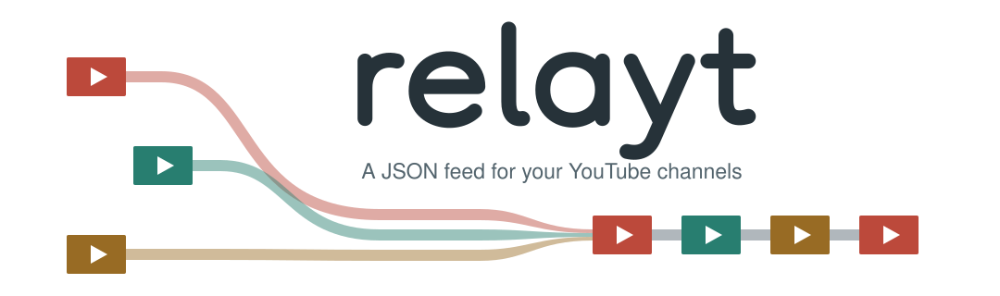

<picture>
  <source media="(prefers-color-scheme: dark)" srcset=".github/banner.svg">
  <source media="(prefers-color-scheme: light)" srcset=".github/banner-light.svg">
  
</picture>

A small self-hosted JSON feed for YouTube channels. It groups channels, tracks new uploads through WebSub and periodically reconciles data with the YouTube API.

## Install

1. Download the binary for your platform from the [latest release](https://github.com/coalaura/relayt/releases/latest).
2. Copy `example.config.yml` to `config.yml` next to the binary.
3. Edit the configuration and run the binary.

The SQLite database is created automatically at `data/database.db`.

## Configuration

```yaml
server:
  listen: ":5151"
  public-url: "https://yt.example.com"

youtube:
  api-key: "${YOUTUBE_API_KEY}"
  include-shorts: false
  include-member-videos: false
  subscribe: true

groups:
  - name: Development
    channels:
      - UCxxxxxxxxxxxxxxxxxxxxxx
```

`public-url` must be externally reachable when `subscribe` is enabled. Environment variables in `config.yml` are expanded at startup.

`include-member-videos` adds long-form members-only uploads from YouTube's derived members playlist when it is available. YouTube does not officially document this playlist, so failures are logged without interrupting public video updates.

## API

| Endpoint | Description |
| --- | --- |
| `GET /healthz` | Health check |
| `GET /api/videos?limit=50` | Videos from all configured channels |
| `GET /api/groups/{group}/videos?limit=50` | Videos from one group |

Group names are converted to lowercase URL slugs. The default limit is 50 and the maximum is 200.

## Glance

An example [`custom-api`](https://github.com/glanceapp/glance) widget is available in [`examples/glance`](examples/glance). Copy [`templates/videos.html`](examples/glance/templates/videos.html) into the `templates` directory next to your Glance configuration, add the contents of [`widget.yml`](examples/glance/widget.yml) to a widget column and update its `url` for your relayt instance and group.

## Build

Building from source requires Go 1.26 and a C compiler for SQLite.

```sh
go build -o relayt .
```
